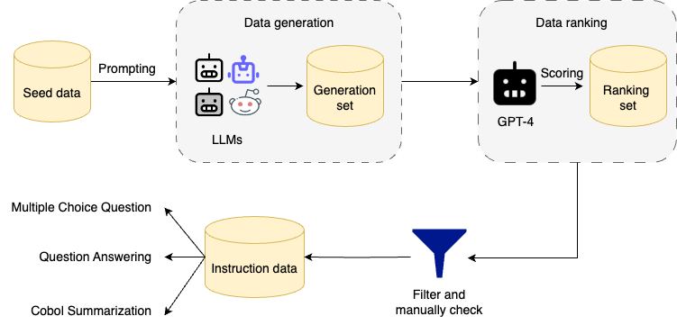

<div align="center">

# XMAiNframe: A Large Language Model for Mainframe Modernization
[](https://opensource.org/licenses/MIT) 
[](link) 
[](https://huggingface.co/collections/Fsoft-AIC/xmainframe-66aca02d5b552e62033dc2bc)  
[](https://www.python.org/downloads/release/python-3100/)

</div>


## Table of Contents
- [Introduction](#dataset-summary)
- [Procedure of Data Construction](#procedure-of-data-construction)
  - [Mainframe-Training](#mainframe-training)
  - [Mainframe-Instruct](#mainframe-instruct)
- [Model Download](#model-download)
- [Evaluation Results](#evaluation-results)
- [Usage](#usage)
  - [Fine-tune XMAiNframe](#how-to-fine-tune-xmainframe)
  - [Inference](#inference)
- [License](##licensing-information)
- [Acknowledgements](#acknowledgements)
- [Contact Us](#contact-us)
- [Citation Information](#citation-information)


# Introduction

We are introducing **XMAiNframe**, a state-of-the-art large language model (LLM) specifically designed with knowledge of mainframe legacy systems and COBOL codebases. XMAiNframe is built on top of DeepSeek-Coder 7B and is available with 7B and 10.5B parameters.
Additionally, we present [MainframeBench](https://huggingface.co/datasets/Fsoft-AIC/MainframeBench), a comprehensive benchmark for assessing mainframe knowledge, including multiple-choice questions, question answering, and COBOL code summarization. Our empirical evaluations demonstrate that XMAiNframe consistently outperforms existing state-of-the-art LLMs across these tasks. Specifically, XMAiNframe achieves 30% higher accuracy than DeepSeek-Coder on multiple-choice questions, doubles the BLEU score of Mixtral-Instruct 8x7B on question answering, and scores six times higher than GPT-3.5 on COBOL summarization. Our work highlights the potential of XMAiNframe to drive significant advancements in managing and modernizing legacy systems, thereby enhancing productivity and saving time for software developers.


# Procedure of Data Construction
## Mainframe-Training

We utilized two different sources: using the GitHub API to collect COBOL projects hosted on GitHub and gathering online document data relevant to mainframes. In total, Mainframe-Training Dataset consists of 236 million tokens from documents about the mainframe technology and COBOL constructs. In pre-training process, we combined our Mainframe-Training Dataset with [SlimOrca-Dedup](https://huggingface.co/datasets/Open-Orca/SlimOrca-Dedup) to enrich the model’s mainframe knowledge while retaining its general capabilities.

## Mainframe-Instruct

<div align="center">



</div>

Mainframe-Instruct is a high-quality synthetic dataset created through 5 steps:

- Step 1: 300 seed data instances about Mainframe and COBOL are gathered and annotated by our domain experts.

- Step 2: Using popular LLMs to enrich Mainframe-Instruct from seed data.

- Step 3: Utilizing GPT-4 as an evaluator to judge model responses, scoring the outputs and ranking responses in a pairwise manner.

- Step 4: Filtering and manually checking.

- Step 5: Dividing Mainframe-Instruct into three tasks: Multiple Choice Questions, Question Answering, and COBOL summarization.

Below is the statitcs of Mainframe-Instruct Dataset:

<table>
    <tr>
        <td> </td>
        <td>Training Samples</td>
        <td>Validating Samples</td>
        <td>Testing Samples</td>
    </tr>
    <tr>
        <td>Multiple Choice Questions</td>
        <td>13.894</td>
        <td>1.544</td>
        <td>1.931</td>
    </tr>
    <tr>
        <td>Question Answering</td>
        <td>18.692</td>
        <td>2.078</td>
        <td>2.598</td>
    </tr>
    <tr>
        <td>COBOL Summarization</td>
        <td>9.081</td>
        <td>1.010</td>
        <td>2.523</td>
    </tr>
</table>


[MainframeBench](https://huggingface.co/datasets/Fsoft-AIC/MainframeBench), our benchmark for mainframe knowledge, is the testing set in Mainframe-Instruct Dataset. This benchmark is used to evaluate our LLMs with others which is now available at Huggingface datasets.

```python
ffrom datasets import load_dataset

# Load each sub-set in MainframeBench
QA_set = load_dataset("Fsoft-AIC/MainframeBench", 'question_answering')
MC_set = load_dataset("Fsoft-AIC/MainframeBench", 'multiple_choice_question')
Summarization_set = load_dataset("Fsoft-AIC/MainframeBench", 'COBOL_code_summarization')
```

# Model Download
We release XMAiNframe with 7B and 10.5B parameters, including base and instruct models, to the public. XMAiNframe 10.5B is expanded from DeepSeek-Coder 7B by the depth up-scaling method without introducing additional modules or dynamic expert selection methods.

<div align="center">

|            **Model**            |      **Download**  |
| :-----------------------------: |  :----------------------------------------------------------: |
|   XMAiNframe-base-7b         | [🤗 HuggingFace](https://https://huggingface.co/Fsoft-AIC/XMAiNframe-base-7b/) |
| XMAiNframe-instruct-7b    | [🤗 HuggingFace](https://huggingface.co/Fsoft-AIC/XMAiNframe-instruct-7b) |
|     XMAiNframe-base-10.5b     |       [🤗 HuggingFace](https://huggingface.co/Fsoft-AIC/XMAiNframe-base-10.5b) |
|   XMAiNframe-instruct-10.5b   |   [🤗 HuggingFace](https://huggingface.co/Fsoft-AIC/XMAiNframe-instruct-10.5b) |

</div>


# Evaluation Results
## Multiple Choice Question Task

<table>
    <tr>
        <td style="font-weight:bold">Model</td>
        <td style="font-weight:bold">Accuracy (%)</td>
    </tr>
    <tr>
        <td>GPT-4</td>
        <td>73.90</td>
    </tr>
    <tr>
        <td>GPT-3.5</td>
        <td>74.56</td>
    </tr>
    <tr>
        <td>Mixtral-Instruct 8x7B</td>
        <td>68.12</td>
    </tr>
    <tr>
        <td>Mistral-Instruct 7B</td>
        <td>69.29</td>
    </tr>
    <tr>
        <td>Neural-Chat</td>
        <td>66.35</td>
    </tr>
    <tr>
        <td>DeepSeek-Coder-Instruct 6.7B</td>
        <td>47.49</td>
    </tr>
    <tr>
        <td>DeepSeek-Coder-Instruct 33B</td>
        <td>53.29</td>
    </tr>
    <tr>
        <td>XMAiNframe-Instruct 7B</td>
        <td>68.57</td>
    </tr>
    <tr>
        <td>XMAiNframe-Instruct 10.5B</td>
        <td>77.89</td>
    </tr>
</table>

## Question Answering Task

<table>
    <tr>
        <td style="font-weight:bold">Models</td>
        <td style="font-weight:bold">MAP</td>
        <td style="font-weight:bold">F1-Score</td>
        <td style="font-weight:bold">BERTScore</td>
        <td style="font-weight:bold">RougeL</td>
        <td style="font-weight:bold">Meteor</td>
        <td style="font-weight:bold">BLEU-4</td>
    </tr>
    <tr>
        <td>GPT 4</td>
        <td>0.12</td>
        <td>0.19</td>
        <td>0.88</td>
        <td>0.18</td>
        <td>0.34</td>
        <td>5.71</td>
    </tr>
    <tr>
        <td>GPT 3.5</td>
        <td>0.14</td>
        <td>0.22</td>
        <td>0.89</td>
        <td>0.21</td>
        <td>0.38</td>
        <td>7.36</td>
    </tr>
    <tr>
        <td>Mixtral-Instruct 8x7B</td>
        <td>0.27</td>
        <td>0.31</td>
        <td>0.9</td>
        <td>0.29</td>
        <td>0.38</td>
        <td>11.39</td>
    </tr>
    <tr>
        <td>Mistral-Instruct 7B</td>
        <td>0.12</td>
        <td>0.19</td>
        <td>0.87</td>
        <td>0.18</td>
        <td>0.34</td>
        <td>5.74</td>
    </tr>
    <tr>
        <td>Neural-Chat</td>
        <td>0.13</td>
        <td>0.21</td>
        <td>0.88</td>
        <td>0.2</td>
        <td>0.36</td>
        <td>6.45</td>
    </tr>
    <tr>
        <td>DeepSeek-Coder-Instruct 6.7B</td>
        <td>0.09</td>
        <td>0.15</td>
        <td>0.86</td>
        <td>0.14</td>
        <td>0.30</td>
        <td>4.09</td>
    </tr>
    <tr>
        <td>DeepSeek-Coder-Instruct 33B</td>
        <td>0.09</td>
        <td>0.15</td>
        <td>0.86</td>
        <td>0.15</td>
        <td>0.31</td>
        <td>4.41</td>
    </tr>
    <tr>
        <td>XMAiNframe-Instruct 7B</td>
        <td>0.45</td>
        <td>0.42</td>
        <td>0.92</td>
        <td>0.4</td>
        <td>0.42</td>
        <td>20.43</td>
    </tr>
    <tr>
        <td>XMAiNframe-Instruct 10.5B</td>
        <td>0.43</td>
        <td>0.42 </td>
        <td>0.92   </td>
        <td>0.4  </td>
        <td>0.42   </td>
        <td>20.93 </td>
    </tr>
</table>

## COBOL Code Summarization
<table>
    <tr>
        <td style="font-weight:bold">Models</td>
        <td style="font-weight:bold">MAP</td>
        <td style="font-weight:bold">F1-Score</td>
        <td style="font-weight:bold">BERTScore</td>
        <td style="font-weight:bold">RougeL</td>
        <td style="font-weight:bold">Meteor</td>
        <td style="font-weight:bold">BLEU-4</td>
    </tr>
    <tr>
        <td>GPT 4</td>
        <td>0.12</td>
        <td>0.19</td>
        <td>0.88</td>
        <td>0.18</td>
        <td>0.34</td>
        <td>5.71</td>
    </tr>
    <tr>
        <td>GPT 3.5</td>
        <td>0.14</td>
        <td>0.22</td>
        <td>0.89</td>
        <td>0.21</td>
        <td>0.38</td>
        <td>7.36</td>
    </tr>
    <tr>
        <td>Mixtral-Instruct 8x7B</td>
        <td>0.27</td>
        <td>0.31</td>
        <td>0.9</td>
        <td>0.29</td>
        <td>0.38</td>
        <td>11.39</td>
    </tr>
    <tr>
        <td>Mistral-Instruct 7B</td>
        <td>0.12</td>
        <td>0.19</td>
        <td>0.87</td>
        <td>0.18</td>
        <td>0.34</td>
        <td>5.74</td>
    </tr>
    <tr>
        <td>Neural-Chat</td>
        <td>0.13</td>
        <td>0.21</td>
        <td>0.88</td>
        <td>0.2</td>
        <td>0.36</td>
        <td>6.45</td>
    </tr>
    <tr>
        <td>DeepSeek-Coder-Instruct 6.7B</td>
        <td>0.09</td>
        <td>0.15</td>
        <td>0.86</td>
        <td>0.14</td>
        <td>0.30</td>
        <td>4.09</td>
    </tr>
    <tr>
        <td>DeepSeek-Coder-Instruct 33B</td>
        <td>0.09</td>
        <td>0.15</td>
        <td>0.86</td>
        <td>0.15</td>
        <td>0.31</td>
        <td>4.41</td>
    </tr>
    <tr>
        <td>XMAiNframe-Instruct 7B</td>
        <td>0.45</td>
        <td>0.42</td>
        <td>0.92</td>
        <td>0.4</td>
        <td>0.42</td>
        <td>20.43</td>
    </tr>
    <tr>
        <td>XMAiNframe-Instruct 10.5B</td>
        <td>0.43</td>
        <td>0.42 </td>
        <td>0.92   </td>
        <td>0.4  </td>
        <td>0.42   </td>
        <td>20.93 </td>
    </tr>
</table>

For more evaluation details and settings, please check our paper. 


# Usage
## Fine-tune XMAiNframe
To run the code in this project, first, create a Python virtual environment using e.g. Conda:

```shell
conda create -n xmainframe python=3.10 && conda activate xmainframe
```

You can then install the remaining package dependencies as follows:

```shell
git clone https://github.com/FSoft-AI4Code/XMainframe.git
cd XMainframe
pip install -r requirements.txt
```
You can now check out the `scripts` and `recipes` directories for instructions on how to fine-tune our model 🪁!


## Inference

Here provides a code snippet with `apply_chat_template` to show you how to load the tokenizer and model and how to generate contents.


```python
from transformers import AutoTokenizer, AutoModelForCausalLM
tokenizer = AutoTokenizer.from_pretrained("Fsoft-AIC/XMAiNframe-instruct-7b")
model = AutoModelForCausalLM.from_pretrained("Fsoft-AIC/XMAiNframe-instruct-7b")
messages=[
    {'role':'system','content':"You are a helpful assistant"},
    {'role': 'user', 'content': 'What is the future of Mainframe?'}
]
inputs = tokenizer.apply_chat_template(messages, add_generation_prompt=True, return_tensors="pt").to(model.device)
 
outputs = model.generate(inputs, max_new_tokens=512, do_sample=False, top_k=50, top_p=0.95, num_return_sequences=1, eos_token_id=tokenizer.eos_token_id)
print(tokenizer.decode(outputs[0][len(inputs[0]):], skip_special_tokens=True))
```


# License
This code repository is licensed under [the MIT License](LICENSE)

# Acknowledgements
This codebase is adapted from:
- [alignment-handbook](https://github.com/huggingface/alignment-handbook)

# Contact us
If you have any questions, comments or suggestions, please do not hesitate to contact us.
- Website: [fpt-aicenter](https://www.fpt-aicenter.com/ai-residency/)
- Email: support.ailab@fpt.com

# Citation Information
More details can be found in our [technical report](https://github.com/FSoft-AI4Code/). 

If you're using XMAiNframe, please cite using this BibTeX:
```bibtex
@article{,
  title={XMainframe: A Large Language Model for Mainframe Modernization},
  author={},
  journal={arXiv preprint arXiv:2406.11927v1},
  year={2024}
}
```
